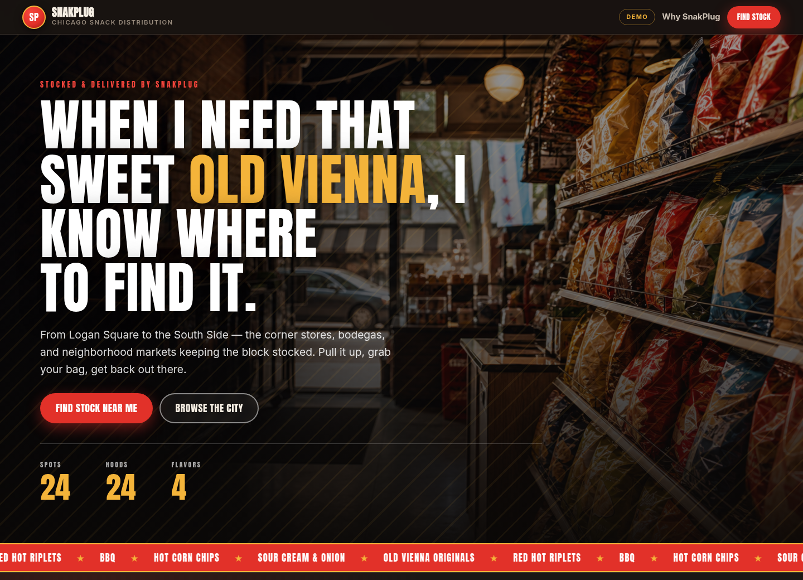

# SnakPlug — Chicago Snack Distribution

*When you need more of that sweet Old Vienna, you know where to find it.*

The official site for **SnakPlug**, the Chicago distributor that finds the
storefronts, stocks the shelves, and gets **Old Vienna** into hands all over the
city. The centerpiece is a fast, mobile-first, app-style finder for every spot
SnakPlug keeps stocked — no map to fuss with, just a clean list and one-tap
directions. *Local. Delivered. Loved.*

🔗 **Live demo:** https://snakplug.github.io/locations/

> ⚠️ **Demo build.** This site ships with *sample* store data for
> demonstration purposes — every record is flagged `demo` and labeled in the
> UI. No real store inventory is published. See [Editing store data](#editing-store-data).



---

## Highlights

- **Urban, app-style feel** — dark, street-forward design with a full-bleed
  hero, a flavor ticker, and a fast card feed that reads like a native app.
- **Find stock near you** — optional one-tap geolocation sorts spots by real
  distance and ranks the closest first (nothing is sent to a server).
- **Search & filter** — instant search by spot, neighborhood, or ZIP, plus
  area filters (North / West / South / Suburbs).
- **Native directions** — every spot's Directions button hands the address
  straight to the phone's maps app: **Apple Maps on iOS**, **Google Maps**
  (native app on Android, web elsewhere).
- **No map dependency, no API keys** — a single static page, no tiles to load,
  deploys straight to GitHub Pages.
- **Accessible** — keyboard-friendly cards, visible focus states, ARIA labels,
  and reduced-motion support.

## Tech stack

| Concern | Tool |
| --- | --- |
| Type | [Anton](https://fonts.google.com/specimen/Anton) + [Inter](https://fonts.google.com/specimen/Inter) via Google Fonts |
| Directions | Native deep links — [Apple Maps](https://maps.apple.com/) / [Google Maps](https://www.google.com/maps) |
| Data | Plain [`locations.csv`](locations.csv) — edit in any spreadsheet |
| Hosting | [GitHub Pages](https://pages.github.com/) |

No framework, no bundler, no map library — just HTML, CSS, and vanilla JavaScript.

## Project structure

```
locations/
├── index.html        # Page markup
├── styles.css        # Design system + responsive layout
├── app.js            # Search, filters, geolocation, directions
├── locations.csv     # Store data (edit this to add stores)
├── favicon.svg       # Brand mark
├── assets/           # Images (hero photo)
├── docs/             # README assets (preview image)
└── .nojekyll         # Tell GitHub Pages to serve files as-is
```

## Local development

No dependencies to install — serve the folder with any static file server:

```bash
python3 -m http.server 8087
```

Then open **http://127.0.0.1:8087**.

> To preview on a phone on the same Wi-Fi, bind to all interfaces
> (`python3 -m http.server 8087 --bind 0.0.0.0`) and visit
> `http://<your-computer-ip>:8087` from the phone.

## Editing store data

All stores live in [`locations.csv`](locations.csv). Edit it in any spreadsheet
or text editor and refresh — no rebuild required.

```csv
id,name,address,neighborhood,area,zip,lat,lng,hours,products,notes,demo
store-name-60600,Store Name,"123 Example Ave, Chicago, IL 60600",Neighborhood,north,60600,41.8781,-87.6298,Daily 9 AM-9 PM,"Old Vienna chips; Red Hot Riplets",Endcap display near checkout,false
```

| Column | Notes |
| --- | --- |
| `id` | Unique, URL-safe identifier |
| `name`, `address`, `neighborhood`, `zip` | Display text |
| `area` | One of `north`, `west`, `south`, `suburbs` (drives the filters) |
| `lat`, `lng` | Coordinates — power the "near me" distance ranking. Optional, but recommended so sorting works without a geocoding API |
| `hours` | Free text, e.g. `Daily 9 AM-9 PM` |
| `products` | Semicolon-separated list, e.g. `Old Vienna chips; BBQ chips` |
| `notes` | Optional context shown on the card |
| `demo` | `true` shows the data is a sample; set `false` for real stores |

Tip: grab coordinates by right-clicking a spot in
[Google Maps](https://www.google.com/maps) → the lat/lng appears at the top.

## Deployment

The site is fully static and deploys to **GitHub Pages** with no build step.
Enable Pages in the repository settings
(**Settings → Pages**) and point it at this branch's root. Because
`index.html` uses relative paths, it works at a project sub-path
(`/locations/`) out of the box.

## License & data

Sample store data is fictional and for demonstration only. Brand assets belong
to their respective owners.

---

Designed & built as a demonstration of mobile-first web design and
brand-forward UX.
